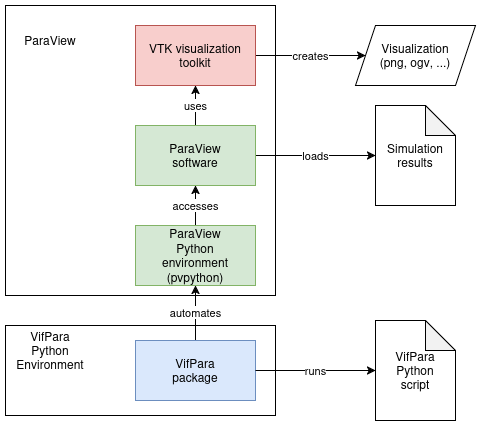

<div align="center">

  <h1>VifPara</h1>
  <h2>OpenFoam & MESHFREE Post-Processing Toolkit</h2>
</div>

<div align="center">
  
  
  
  
</div>

VifPara is a Python library that automates ParaView to produce high‑quality visuals from OpenFOAM and MESHFREE simulations.
It helps you generate reproducible 2D/3D plots, animations, comparative layouts, and batch visualizations.

# Key Features
- **Cross-platform compatibility** - Works on Linux and Windows
- **Multiple file formats** - Supports OpenFOAM and Ensight
- **Flexible configuration** - JSON-based configuration system
- **Comprehensive visualization** - 2D slices, 3D views, animations, and more
- **Visualization Automation** - Generate many different visualizations and animations with a single script

# Example Code
The following code takes a finished OpenFoam simulation testcase and outputs an image of a slice of the case through the center with a view along the y-axis.

To make this code work, you need to install [ParaView](https://www.paraview.org/download/) and download VifPara into a compatible Python environment (see below).

```python
from vifpara import *

if __name__ == "__main__":
    # Read config and load case
    config = Config(custom_config = {"case_path": "tutorials/incompressible/simpleFoam/motorBike/case.foam",
                                     "dir_plots": "plots/motorBike",
                                     "dir_logs": "logs/motorBike"})
    case = Case(config=config, case_type=CaseType.RECONSTRUCTED)

    # Define single view layout
    layout = Layout([1])

    # Create color map
    cmap = ColorMap(field="U")

    # Create slice object
    slice_obj = Slice(
        case=case,
        color_map=cmap,
        normal=Vector3(0.0, 1.0, 0.0))

    # Render slice in single view layout
    slice_obj.render(layout)
    layout.set_height(800)
    exporter = Exporter(config=config, layout=layout)

    # Save screenshot of slice
    exporter.save_snapshot(filename="minimal_example")
```

Example output:


> **Info**
> To test the example, you need to download the [OpenFoam motorbike testcase](https://develop.openfoam.com/Development/openfoam/-/tree/OpenFOAM-v2412/tutorials/incompressible/simpleFoam/motorBike) and run it with OpenFoam. Afterwards, you point the case_path in the config to the case.foam of the testcase. If it does not exist, just create an empty file with this name in the cases root directory. Afterwards, do not run the script with ```python```, ```python3```, ```etc.``` but with ```vifpara```, which is a dedicated runner installed together with the package.


# Software Concept & Supported ParaView Versions
VifPara is a library which adds itself on top of your installed ParaView Python environment (pvpython) via an external Python environment.
Therefore, it is crucial, that the Python version you install and use VifPara in, is the same your ParaView installation uses internally.

Please make sure your installed ParaView version is between 5.11 and 5.13. ParaView version 6 is currently not supported.

Tested and working configurations are:
- ParaView 5.11 - Python 3.12
- ParaView 5.12 - Python 3.10
- ParaView 5.13 - Python 3.10



# Installation & Use
For information of how to install and use VifPara consult the user documentation and API reference:

<b>[User Documentation](documentation/markdown/index.md)</b>

Alternatively you can use the [documentation in the GitHub repo](documentation/markdown/index.md).

In the [examples directory](examples/), you can find several example scripts of how to use VifPara, which can be used as templates to start from. The result of most example scripts can be found in the [reference_exports directory](examples/reference_exports/) in the examples directory.


# Contact
Virtual Vehicle Research GmbH: https://www.v2c2.at

## Team

  - **Project Lead** - Cyril Marx (cyril.marx@v2c2.at)
  - **Developer** - Juliana Madritsch
  - **Developer** - Florian Michelic


# Acknowledgments
Virtual Vehicle Research GmbH has received funding within COMET Competence Centers for Excellent Technologies from the Austrian Federal Ministry for Climate Action, the Austrian Federal Ministry for Labour and Economy, the Province of Styria (Dept. 12) and the Styrian Business Promotion Agency (SFG). The Austrian Research Promotion Agency (FFG) has been authorised for the programme management.